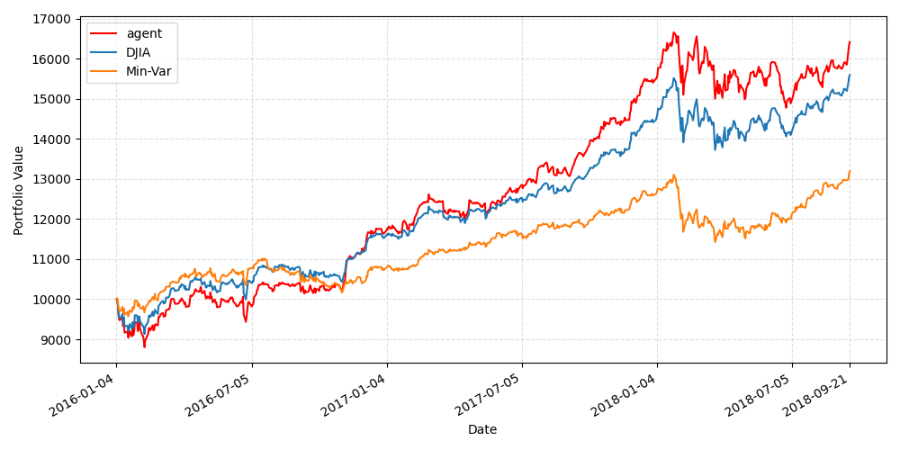
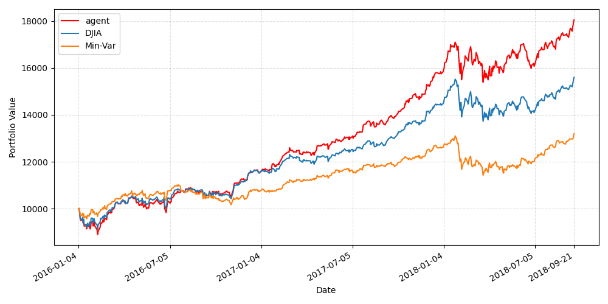
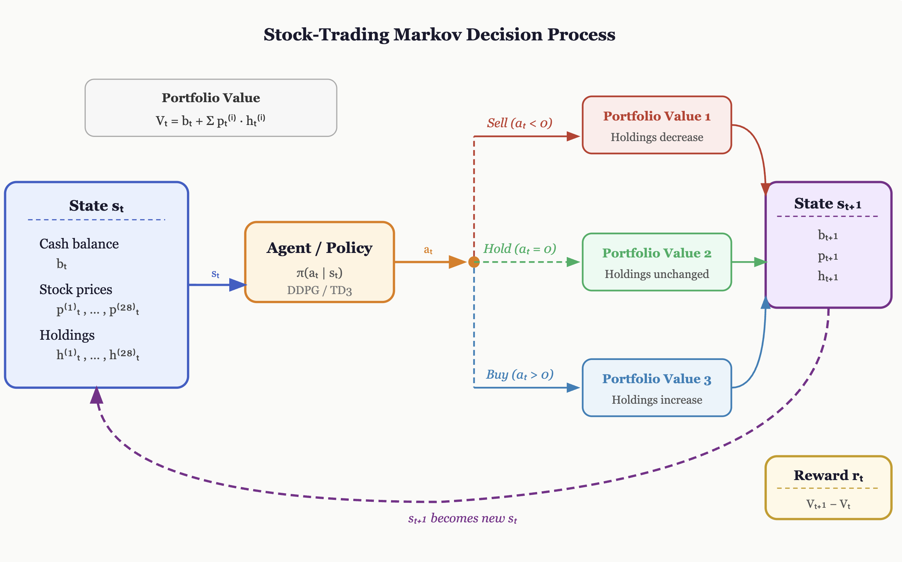

# RL Stock Trading — DDPG & TD3 Reproduction (COMP-579)

Reproduction of [*Practical Deep Reinforcement Learning Approach for Stock Trading*](https://arxiv.org/abs/1811.07522) (Liu et al., 2018), with an added TD3 comparison and a COVID-19 stress test.

Reference upstream project: [AI4Finance-Foundation/Deep-Reinforcement-Learning-for-Stock-Trading-DDPG-Algorithm-NIPS-2018](https://github.com/AI4Finance-Foundation/Deep-Reinforcement-Learning-for-Stock-Trading-DDPG-Algorithm-NIPS-2018)

---

## Report & Slides

| Document | Link |
|---|---|
| Full report (NeurIPS format) | [`pdfs/report.pdf`](pdfs/report.pdf) |
| Presentation slides | [`pdfs/project_video_slides.pdf`](pdfs/project_video_slides.pdf) |

---

## Results Summary

We train DDPG and TD3 on the original Dow Jones 28-stock universe (2009–2014), validate on 2015, and trade online on 2016–2018, comparing against DJIA and a min-variance portfolio baseline. Each RL result is the mean across seeds 42, 43, 44.

### Main reproduction (2016–2018 test period)

| Metric | DDPG | TD3 | Min-Variance | DJIA |
|---|---|---|---|---|
| Initial Portfolio Value | $10,000 | $10,000 | $10,000 | $10,000 |
| Final Portfolio Value | **$16,141** (±631) | **$16,919** (±1003) | $13,194 | $15,595 |
| Annualized Return | 19.25% (±1.73) | 21.31% (±2.62) | 10.74% | 17.76% |
| Annualized Std. | 12.78% (±0.99) | 12.67% (±0.88) | 9.37% | 11.74% |
| Sharpe Ratio | 1.51 (±0.15) | **1.68** (±0.20) | 1.15 | 1.51 |

Both RL agents outperform min-variance. TD3 achieves the highest final value and Sharpe ratio.

### Portfolio value curves (seed 42)

<p float="left">
  
  
</p>

### COVID-19 stress test (2020 trading period)

Training on 2010–2019, trading on the volatile 2020 COVID period:

| Metric | DDPG | TD3 | Min-Variance | DJIA |
|---|---|---|---|---|
| Final Portfolio Value | $10,590 (±1262) | $9,786 (±305) | $10,477 | $10,534 |
| Annualized Return | 5.93% (±12.67) | -2.15% (±3.07) | 4.79% | 5.36% |
| Sharpe Ratio | 0.18 (±0.32) | -0.04 (±0.07) | **0.20** | 0.15 |

RL agents do not consistently outperform classical baselines under a volatile regime shift, highlighting sensitivity to market crashes.

---

## MDP Formulation

Stock trading is modelled as a finite-horizon MDP over daily trading steps.



| Component | Definition |
|---|---|
| **State** | `[cash, price_1…price_28, holdings_1…holdings_28]` — 57-dimensional vector |
| **Action** | 28-dimensional integer vector; each entry in `{-5, …, 5}` — negative=sell, positive=buy, 0=hold |
| **Reward** | Change in total portfolio value: `V(t+1) - V(t)` |
| **Episode** | One pass through a data split (train / validation / test) starting with $10,000 cash and zero holdings |

---

## Repository Layout

```
.
├── README.md
├── pyproject.toml          # Python project & dependency metadata (managed with uv)
├── uv.lock
├── run_in_bg.sh            # Launch DDPG + TD3 main-reproduction runs in parallel
├── run_in_bg_covid.sh      # Launch DDPG + TD3 COVID stress-test runs in parallel
├── data/
│   ├── dow_jones_30_daily_price.csv   # Original DJ-30 daily prices (from upstream)
│   ├── ^DJI.csv                       # DJIA index prices (from upstream)
│   └── covid/                         # yfinance-fetched data for the COVID experiment
├── outputs/                # Training/trading results (model checkpoints, plots, metrics JSON)
├── pdfs/
│   ├── report.pdf                     # Final project report
│   └── project_video_slides.pdf       # Presentation slides
├── project_report/         # LaTeX source for the report
│   ├── report.tex
│   ├── report.bib
│   └── resources/          # Figures embedded in the report
├── project_video/          # LaTeX source for the presentation slides
├── selected_outputs/       # Curated result plots stored via Git LFS
└── src/                    # Main codebase (see below)
```

---

## Source Code (`src/`)

### `stock_env.py` — Custom Gymnasium Trading Environment

Implements `StockEnv`, a `gym.Env` subclass that wraps the Dow Jones price series as a sequential trading environment.

- **`__init__`**: loads price data via `data_loader`, builds `prices_array`, defines the observation space (`Box[0, ∞, shape=(1+2·n_stocks,)]`) and the action space (`Box[-5, 5, shape=(n_stocks,)]`). In test mode, also pre-computes DJIA and min-variance growth curves for benchmark comparison.
- **`step(actions)`**: clips and rounds continuous actions to integers, executes sells then buys (sells first to free up cash), advances the day, and returns the reward as the change in total portfolio value.
- **`_sell_stock` / `_buy_stock`**: cash-constrained order execution helpers; buy orders are limited by available cash, sell orders by current holdings.
- **`reset`**: restores the initial state (`[init_balance, prices_day0..., 0...0]`) and asset memory.
- Test mode also tracks `dji_growth` and `min_variance_growth` arrays for benchmark evaluation.

### `rl_algos.py` — Training, Tuning, and Online Trading

Central RL module wrapping Stable-Baselines3's DDPG and TD3 implementations.

- **`_build_model`**: constructs either a DDPG or TD3 model with a [400, 300] MLP actor-critic (matching the Lillicrap et al. architecture) and `NormalActionNoise`.
- **`train`**: trains a model from scratch for a fixed number of timesteps and saves the checkpoint.
- **`tune`**: Bayesian hyperparameter search with Optuna (TPE sampler) over learning rate, batch size, γ, τ, and noise σ. Evaluates each trial on the validation split.
- **`trade_online`**: loads a trained checkpoint and continues learning during the trading phase (matching the original paper's online-learning evaluation protocol).

### `main.py` — Full Pipeline Entrypoint

Orchestrates the full `tune → train → trade` pipeline for the original Dow Jones experiment.

- Parses CLI args for algorithm, seeds, training budget (`--n_episodes` or `--timesteps`), and Optuna settings.
- Tunes hyperparameters once using the first seed, then trains and trades independently per seed.
- When multiple seeds are provided (`--seeds`), training runs in parallel via `ProcessPoolExecutor`.
- Writes per-seed metrics JSON files and an `aggregate_metrics.json` summarising mean ± std across seeds.

```bash
# Example: reproduce the main results (DDPG, 3 seeds, 50 episodes, 15 Optuna trials)
uv run python -m src.main \
  --dj_30_dp_path data/dow_jones_30_daily_price.csv \
  --dji_path 'data/^DJI.csv' \
  --algo ddpg \
  --seeds 42 43 44 \
  --n_episodes 50 \
  --n_trials 15 \
  --model_out outputs/ddpg_run/ddpg_model \
  --optuna_n_jobs 3
```

### `covid_run.py` — COVID-19 Stress-Test Entrypoint

Same pipeline as `main.py` but targets a custom date range fetched from Yahoo Finance via `yfinance_fetch.py`. Trains on 2010–2019 and trades on the 2020 COVID period.

### `baseline_strategies.py` — Benchmark Baselines

- **`compute_dji_account_growth`**: aligns the DJIA index price series to the environment's episode dates and simulates a buy-and-hold account starting from `init_balance`.
- **`compute_min_variance_portfolio_growth`**: uses [PyPortfolioOpt](https://github.com/robertmartin8/PyPortfolioOpt) (`EfficientFrontier.min_volatility()`) to compute static buy-and-hold weights on the training-split prices, then simulates growth over the test episode.
- **`compute_portfolio_metrics`**: computes final portfolio value, annualized return, annualized standard deviation, and Sharpe ratio for any equity curve.
- **`aggregate_metrics`**: computes mean and std of agent metrics across seeds; baselines are deterministic so only one value is reported.

### `data_loader.py` — Price Data Preprocessing

- **`build_daily_frames`**: reads `dow_jones_30_daily_price.csv`, filters to 28 consistently-present stocks (using the original paper's `TICKER_COUNT_MAGIC_NUM` heuristic plus NKE and KO), drops two post-9/11 dates, computes adjusted close prices (`prccd / ajexdi`), and splits into train/validation/test date ranges matching the paper's specification:
  - Train: 2009-01-01 – 2014-12-31
  - Validation: 2015-01-01 – 2015-12-31
  - Test: 2016-01-01 – 2018-09-30

### `registration.py` — Gymnasium Environment Registration

Registers four named Gym environments (`ORIGINAL_TRAIN`, `ORIGINAL_VALIDATE`, `ORIGINAL_TRADE`, and a COVID variant) so that `gym.make(...)` can be used from the training and tuning loops. Each registration captures the data paths and environment parameters at startup.

### `config.py` — Run Configuration

`RunConfig` dataclass that bundles the algorithm name, seed, and model output directory. Exposes derived paths for the online model checkpoint, training figure, test figure, and per-seed metrics JSON.

### `plots.py` — Result Plotting

Generates the portfolio-value-over-time figures comparing the RL agent, DJIA, and min-variance baseline at the end of each trading episode.

### `yfinance_fetch.py` — Custom Data Fetching

Fetches daily adjusted close prices for the Dow Jones 30 constituents over a custom date range using the [yfinance](https://github.com/ranaroussi/yfinance) API and formats them into the same CSV schema expected by `data_loader` and `StockEnv`. Used to populate `data/covid/` for the stress test.

### `trade.py` — Trade Execution Utilities

Helper functions for the trading phase, including utilities for loading a saved model checkpoint and running one full episode.

---

## Setup

Install [uv](https://docs.astral.sh/uv/getting-started/installation/) then sync dependencies:

```bash
uv sync
```

This creates a `.venv` with all required dependencies.

---

## Running Experiments

Two convenience scripts launch DDPG and TD3 in parallel as background processes and stream logs to `outputs/logs/`.

### Main reproduction (original Dow Jones split)

```bash
./run_in_bg.sh
# Runs: 50 episodes, 15 Optuna trials, seeds 42/43/44
# Logs: outputs/logs/ddpg_report_50ep_15trials.log
#        outputs/logs/td3_report_50ep_15trials.log
```

### COVID-19 stress test

```bash
./run_in_bg_covid.sh
# Trains on 2010–2019, trades on 2020 (500 episodes, seeds 42/43/44)
```

### Running a single algorithm manually

```bash
uv run python -m src.main \
  --dj_30_dp_path data/dow_jones_30_daily_price.csv \
  --dji_path 'data/^DJI.csv' \
  --algo td3 \
  --seeds 42 43 44 \
  --n_episodes 30 \
  --n_trials 10 \
  --model_out outputs/td3_run/td3_model
```

Pass `--n_trials 0` to skip Optuna tuning and use default hyperparameters.
